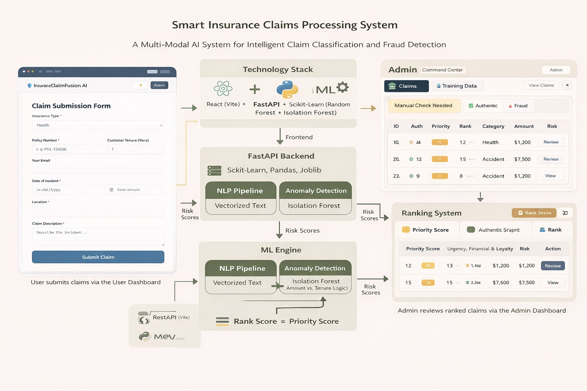

# 🏦 Smart Insurance Claims Processing System

> **A Multi-Modal AI System for Intelligent Claim Classification and Fraud Detection.**

[](https://github.com/dineshingale/my-app-monorepo)
[](https://opensource.org/licenses/MIT)

---

## 🧐 1. Problem Statement

In the traditional insurance industry, claims processing is a bottleneck. It is manual, slow, and prone to human error. Authenticating claims requires cross-referencing policy details, analyzing incident descriptions, and flagging potential fraud—a process that can take weeks. 

**Key Challenges:**
*   **Slow Turnaround:** Customers wait days or weeks for approval.
*   **Fraud Leakage:** Subtle patterns in fraudulent claims are often missed by human reviewers.
*   **Operational Interaction:** High volume of manual checks for routine, low-value claims.

Our goal was to build a system that **automates the triage process**, instantly flagging fraud while fast-tracking authentic claims.

---

## 💡 2. Solution Approach

We engineered a **Claims Intelligence Platform** that combines **Natural Language Processing (NLP)** with **Anomaly Detection**.

*   **Intelligent Triage:** We don't just "store" claims; we understand them. Using Random Forest classifiers on vectorized text, we categorize claims (Health, Accident, Theft) automatically.
*   **Fraud Detection Engine:** We used an **Isolation Forest** algorithm to detect statistical anomalies in claim amount and customer tenure, flagging suspicious outliers.
*   **Ranking System:** We introduced a "Rank Score" logic (`Authenticity * Priority`) to help claims officers focus on what matters most—high-value, authentic claims or critical fraud reviews.

---

## 🏗️ 3. System Architecture & Workflow



### Tech Stack
*   **Frontend:** React (Vite) + Soft UI Design System (Custom CSS + Dark Mode)
*   **Backend:** Python FastAPI (REST API)
*   **ML Engine:** Scikit-Learn (Random Forest + Isolation Forest), Pandas, Joblib
*   **Data Persistence:** CSV (File-based storage for prototype simplicity)

### Application Workflow
1.  **Submission:** User submits a claim via the React Client.
2.  **Processing (The Brain):**
    *   **NLP Pipeline:** Analyzes the `Description` to predict the category.
    *   **Keyword Analysis:** Scans for urgency keywords (e.g., "emergency", "crash").
    *   **Anomaly Detection:** `IsolationForest` scores the `Amount` vs. `Tenure` logic.
3.  **Scoring Logic:**
    *   **Authenticity (1-9):** Derived from the anomaly score (1 = Fraud, 9 = Authentic).
    *   **Priority (1-9):** Calculated based on urgency, financial value, and customer loyalty.
    *   **Rank:** Authenticity × Priority.
4.  **Admin Dashboard:** Claims are sorted by Rank and filtered into "Manual Check", "Authentic", and "Fraud" tabs for efficient review.

---

## 🚀 4. Getting Started (Demo)

Follow these steps to run the full stack locally.

### Prerequisites
*   Node.js (v18+)
*   Python (v3.9+)

### Installation

1.  **Clone the Repository**
    ```bash
    git clone https://github.com/dineshingale/my-app-monorepo.git
    cd my-app-monorepo
    ```

2.  **Start the Backend (Brain)**
    ```bash
    cd apps/server
    pip install -r requirements.txt
    
    # Run the FastAPI server
    python -m uvicorn main:app --reload --port 8000
    ```

3.  **Start the Frontend (Client)**
    ```bash
    # Open a new terminal
    cd apps/client
    npm install
    npm run dev
    ```

4.  **Access the Application**
    *   **User Portal:** `http://localhost:5173/` (Submit a claim)
    *   **Admin Dashboard:** `http://localhost:5173/admin` (View analytics & train model)

---

## 🧠 5. Core Logic

### Machine Learning Pipeline
The heart of the system is in `apps/server/main.py`.

```python
# 1. NLP Pipeline
nlp_pipeline = Pipeline([
    ('vectorizer', CountVectorizer(stop_words='english')),
    ('classifier', RandomForestClassifier(n_estimators=100))
])

# 2. Anomaly Detection (Fraud)
iso_forest = IsolationForest(contamination=0.1)
iso_forest.fit(df[['Amount', 'Customer_Tenure']])
```

### The Ranking Algorithm
To assist human decision-making, we synthesize raw ML scores into business metrics.

$$ \text{Rank} = \text{Authenticity Score} \times \text{Priority Score} $$

*   **Authenticity:** Sigmoid mapping of the Isolation Forest decision function.
*   **Priority:** Weighted sum of Urgency (+2), High Value (+2), and VIP Tenure (+2).

---

## 🔮 6. Future Improvements

*   **Models:** Upgrade to Transformer-based models (BERT) for deeper semantic understanding of claim descriptions.
*   **Infrastructure:** Migrate CSV storage to a proper database (PostgreSQL) and containerize with Docker (Issue #13).
*   **Security:** Implement JWT Authentication for specific Admin routes.
*   **Integration:** Add email notifications (SendGrid/Novu) when a claim is flagged as "High Priority".

---

### 🤝 Collaboration
This project is developed using a structured **Git Workflow**:
`Issue` -> `Branch` -> `Implementation` -> `Pull Request` -> `Merge`.

See ours [Development Workflow](./development/standard_workflow.md) for details.
